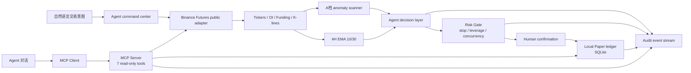

# Strategy Copilot · Architecture

## Runtime boundaries

- `frontend/app/AgentConsole.tsx`：展示 Agent 工作流和 Paper 结果；自然语言输入调用同仓库 Tool Layer，不拥有真实交易权限。
- `frontend/app/api/paper/route.ts`：Next.js 只读代理，把页面请求转发到同机 Paper worker。
- `frontend/app/api/agent/route.ts`：Next.js POST 代理，把意图和策略转发到传统 Tool Layer。
- `frontend/app/api/agent/chat/route.ts`：Next.js POST 代理，把 Agent 对话转发到 MCP Agent worker。
- `backend/server/sources.mjs`：统一 Bitget、OKX、Binance 的行情字段；参赛页面使用 Binance Futures 公共接口。
- `backend/server/strategies.mjs`：注册策略和 Paper 风险参数。
- `backend/server/index.mjs`：周期扫描、策略调用、持仓管理、权益快照和 `/api/agent/run`。
- `backend/server/paper.mjs`：本地模拟开平仓和费用计算。
- `backend/server/mcp-runtime.mjs`：使用标准 MCP SDK 建立本地 Client/Server 和 7 个只读工具。
- `backend/server/agent-chat.mjs`：本地 Agent 意图路由、MCP 工具编排、中文回答和 Tool Trace。

## Agent contract used in the demo

1. `perceive_market`：读取公开 ticker、OI、资金费率和 K 线。
2. `score_opportunities`：调用 A 档或双均线候选生成器。
3. `apply_risk_gate`：检查止损、止盈、杠杆、冷却和最大并发。
4. `prepare_paper_plan`：生成不可广播的本地模拟计划。
5. `append_audit_event`：记录阶段、理由、时间和结果。

这个 contract 已由 `/api/agent/run` 实现；Agent 对话则通过 `/api/agent/chat` 进入真实 MCP Client/Server 工具链。MCP 工具当前只开放 Binance 公开数据、Paper 状态和不可广播的风险检查，真实交易执行仍不在范围内。
